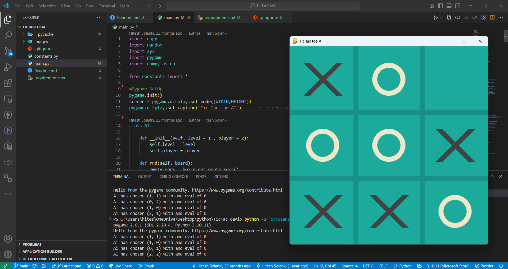

# 🎮 Tic Tac Toe AI (with Minimax) using Pygame

This project is a **Tic Tac Toe game** implemented in Python using **Pygame**, with support for both **Player vs Player** and **Player vs AI** modes. The AI uses the **Minimax algorithm** for perfect play.



---

## 🚀 Features

- ✔️ Single-player vs AI with difficulty levels:
  - Level 0: Random moves
  - Level 1: Minimax AI (unbeatable)
- 🧠 Minimax algorithm implementation with recursive backtracking
- 🎮 Player vs Player mode
- 🔄 Reset and game mode toggle with keyboard
- 🖼️ Graphical interface using `pygame`

---

## 🛠️ Installation

### Requirements

- Python 3.6+
- Pygame
- NumPy

### Install dependencies

```bash
pip install pygame numpy
```

---

## ▶️ Run the Game

```bash
python main.py
```

> Make sure you have all necessary files including `constants.py`.

---

## 🎮 Controls

| Action                    | Key/Mouse   |
| ------------------------- | ----------- |
| Make a move               | Mouse click |
| Reset the game            | `R`         |
| Toggle game mode (PvP/AI) | `G`         |
| Set AI to random mode     | `0`         |
| Set AI to minimax mode    | `1`         |

---

## 🧠 AI Logic

The AI uses a classic **Minimax algorithm** that:

- Evaluates all possible moves recursively
- Chooses the move with the highest score (maximizing for AI, minimizing for player)
- Always plays optimally

---

## 📁 File Structure

```
.
├── main.py              # Main game logic
├── constants.py         # UI and game settings (colors, sizes)
├── images/
│   └── screenshot.png   # Screenshot of the game (optional)
└── README.md
```

---

## 🧑‍💻 Author

Made by Hitesh-s0lanki.
Feel free to fork and enhance!

---

## 📄 License

This project is licensed under the MIT License. See [LICENSE](./LICENSE) for details.

```

```
